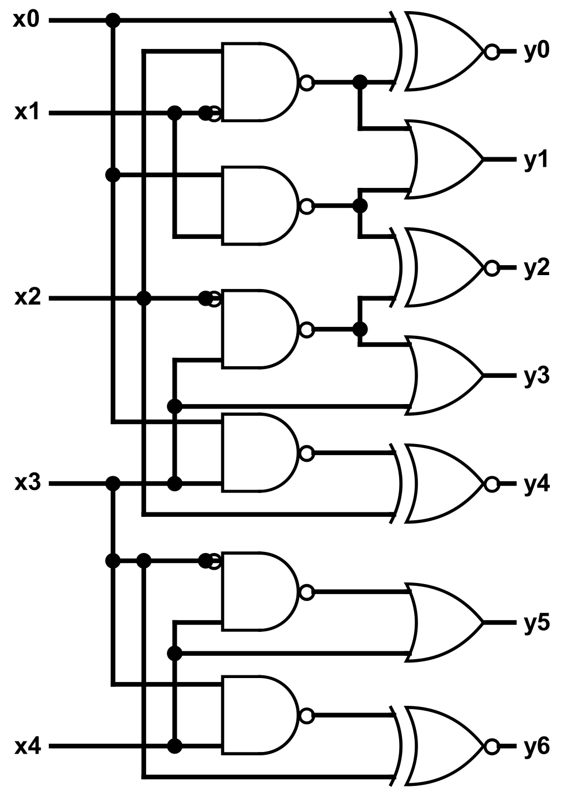
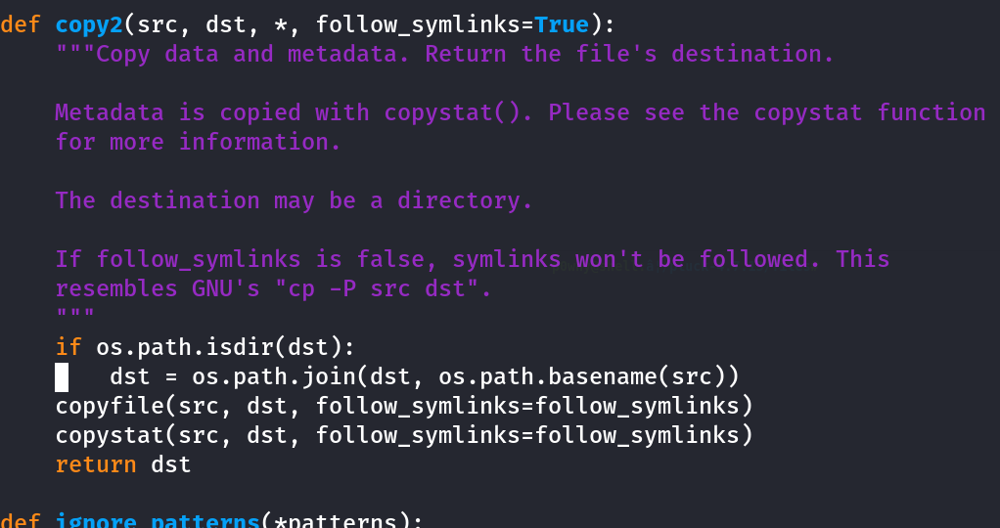

# ORBIT

You are given a logic circuit (see orbit.png) and asked to give the binary output corresponding to the input such that (x0, x1, x2, x3, x4) = (0, 1, 0, 1, 0). Surround your answer with ectf{ } to obtain the flag.

As an example, entering (x0, x1, x2, x3, x4) = (1, 0, 0, 0, 0) gives (y0, y1, y2, y3, y4, y5, y6), so the flag would be ectf{1111010}.

<figure><figcaption></figcaption></figure>

## Logic gates to understand



<figure><figcaption></figcaption></figure>

<figure><figcaption></figcaption></figure>

<figure><figcaption></figcaption></figure>

Those are the only 3 doors needed to be used for solving this challenge

We also need to understand that this:

<figure><figcaption></figcaption></figure>

It represents an inversing of the input which means a bit set to 0 becomes 1 at this input.

So with our input 01010 We can set each values of x and make each input correspond to the value:\

<figure><figcaption></figcaption></figure>

We can then apply each NAND Gates:\
Based on input, if input 1 and 2  equals to 1 then the output is 0 else its 1

<figure><figcaption></figcaption></figure>

<figure><figcaption></figcaption></figure>

Now that we distributed every input and output we can do the OR gates:\
If any of the inputs is 1 the result is 1:

<figure><figcaption></figcaption></figure>

<figure><figcaption></figcaption></figure>

Now we have to finish with XNOR doors.\
The output is 1 if both input and output are equal:

<figure><figcaption></figcaption></figure>

<figure><figcaption></figcaption></figure>

Result is in order of y0 to y6 -> 0101011

## FLAG is : ectf{0101011}

